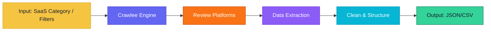
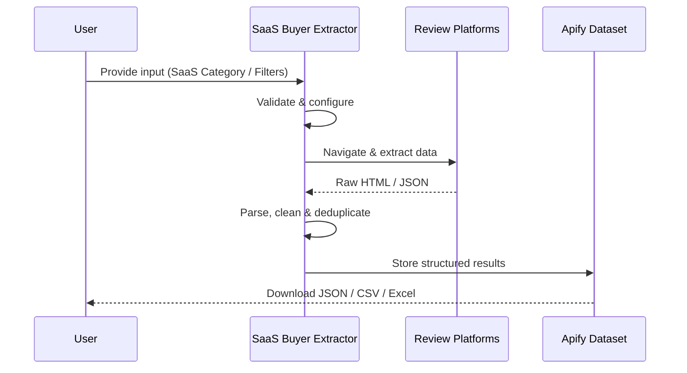
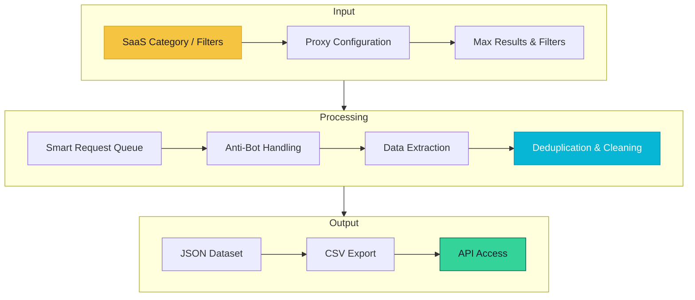

# SaaS Buyer Extractor

> Identify companies actively evaluating SaaS tools by mining review sites and buying intent signals

[](https://apify.com/george.the.developer/saas-buyer-extractor)
[](https://github.com/the-ai-entrepreneur-ai-hub/b2b-buyer-lead-extractor)
[](LICENSE)

---

## Overview

SaaS Buyer Extractor identifies companies showing active buying intent for software solutions. It mines review platforms like G2 and Capterra, monitors comparison pages, and tracks technology adoption signals to find companies in active buying cycles. Delivers sales-ready leads with intent scores and competitive context.

   

---

## Architecture



---

## How It Works



**Step-by-step:**

1. **Input Validation** — Your configuration is validated and the scraping session is initialized with optimal proxy settings
2. **Smart Crawling** — Crawlee manages request queues, retries, and proxy rotation automatically for maximum reliability
3. **Data Extraction** — Structured data is parsed from each page using optimized selectors and anti-detection measures
4. **Deduplication** — Results are deduplicated and cleaned to ensure high data quality with no duplicates
5. **Output Delivery** — Clean, structured data is saved to your Apify dataset for download or API access

---

## Input Parameters

| Parameter | Type | Description |
|-----------|------|-------------|
| `softwareCategory` | `String` | SaaS category (e.g., CRM, ERP, HRMS) |
| `targetCompanySize` | `String` | Company size: startup, smb, mid-market, enterprise |
| `maxLeads` | `Number` | Maximum buyer leads to extract |
| `intentSignals` | `Array` | Types of buying signals to track |
| `geography` | `String` | Target geography for leads |

### Input Example

```json
{
  "softwareCategory": "CRM",
  "targetCompanySize": "mid-market",
  "maxLeads": 200,
  "intentSignals": [
    "review_written",
    "comparison_visited",
    "free_trial_started"
  ],
  "geography": "North America"
}
```

---

## Output Fields

| Field | Type | Description |
|-------|------|-------------|
| `companyName` | `String` | Company name |
| `industry` | `String` | Company industry |
| `companySize` | `String` | Employee count range |
| `intentScore` | `Number` | Buying intent score (0-100) |
| `signalsDetected` | `Array` | Specific buying signals found |
| `currentStack` | `Array` | Current software tools detected |
| `reviewActivity` | `String` | Recent review/comparison activity |
| `website` | `String` | Company website |
| `decisionMakers` | `Array` | Key decision-maker titles identified |

### Output Example

```json
{
  "companyName": "TechFlow Solutions",
  "industry": "SaaS",
  "companySize": "201-500",
  "intentScore": 87,
  "signalsDetected": [
    "Wrote G2 comparison review",
    "Visited pricing pages of 3 CRM vendors"
  ],
  "currentStack": [
    "HubSpot (free tier)",
    "Slack",
    "Notion"
  ],
  "reviewActivity": "Compared 4 CRM solutions on G2 in last 7 days",
  "website": "https://techflow.io",
  "decisionMakers": [
    "VP of Sales",
    "Head of Revenue Operations"
  ]
}
```

---

## Use Cases

- **SDR Prospecting** — Feed sales reps with intent-qualified leads showing active buying behavior
- **ABM Campaigns** — Build account-based marketing lists of companies in active software evaluation
- **Competitive Displacement** — Find companies dissatisfied with competitor products based on review signals
- **Market Sizing** — Quantify the active buyer market for any SaaS category by region
- **Channel Sales** — Identify companies that may need implementation partners or consultants

---

## Data Flow



---

## Pricing

This actor uses Apify's **Pay-Per-Event** pricing. You only pay for what you use.

| Event | Price | Description |
|-------|-------|-------------|
| `lead-extracted` | $0.01 | Per buyer intent lead extracted |
| `signal-tracked` | $0.005 | Per buying signal tracked |

> Free tier available on Apify. No credit card required to start.

---

## Getting Started

### Run on Apify Console

1. Go to [SaaS Buyer Extractor on Apify Store](https://apify.com/george.the.developer/saas-buyer-extractor)
2. Click **"Try for free"**
3. Configure your input parameters
4. Click **"Start"** and wait for results
5. Download your data as JSON, CSV, or Excel

### Run via API

```bash
curl -X POST "https://api.apify.com/v2/acts/george.the.developer~saas-buyer-extractor/runs" \
  -H "Content-Type: application/json" \
  -H "Authorization: Bearer YOUR_API_TOKEN" \
  -d '{"softwareCategory":"CRM","targetCompanySize":"mid-market","maxLeads":200,"intentSignals":["review_written","comparison_visited","free_trial_started"],"geography":"North America"}'
```

### Run with Python

```python
from apify_client import ApifyClient

client = ApifyClient("YOUR_API_TOKEN")
run = client.actor("george.the.developer/saas-buyer-extractor").call(
    run_input={
    "softwareCategory": "CRM",
    "targetCompanySize": "mid-market",
    "maxLeads": 200,
    "intentSignals": [
        "review_written",
        "comparison_visited",
        "free_trial_started"
    ],
    "geography": "North America"
}
)

for item in client.dataset(run["defaultDatasetId"]).iterate_items():
    print(item)
```

---

## Tech Stack

| Technology | Purpose |
|------------|---------|
| **Node.js** | Runtime environment |
| **Crawlee** | Web scraping and crawling framework |
| **Cheerio** | Fast HTML parsing and data extraction |
| **Apify SDK** | Actor lifecycle, storage, and proxy management |

---

## Related Actors

More data extraction tools by [George The Developer](https://apify.com/george.the.developer):

- [Reddit Scraper Pro](https://apify.com/george.the.developer/reddit-scraper-pro) — Extract posts, comments, user profiles, and subreddit data from Reddit at scale 
- [AI Training Data Scraper](https://apify.com/george.the.developer/ai-training-data-scraper) — Collect structured, clean datasets from the web purpose-built for training machi
- [Influencer Marketing Intel](https://apify.com/george.the.developer/influencer-marketing-intel) — Discover and analyze social media influencers with engagement metrics, audience 
- [Google Maps Leads & Website Audit](https://apify.com/george.the.developer/google-maps-leads-website-audit) — Extract business leads from Google Maps with automated website audits for contac
- [App Review Pain Miner](https://apify.com/george.the.developer/app-review-pain-miner) — Extract and analyze app store reviews to discover user pain points, feature requ

[View all actors on Apify Store >>>](https://apify.com/george.the.developer)

---

## Support

- **Apify Store**: [https://apify.com/george.the.developer/saas-buyer-extractor](https://apify.com/george.the.developer/saas-buyer-extractor)
- **GitHub Issues**: [Report a bug](https://github.com/the-ai-entrepreneur-ai-hub/b2b-buyer-lead-extractor/issues)
- **Author**: [George The Developer](https://apify.com/george.the.developer)

---

## License

MIT License. See [LICENSE](LICENSE) for details.

---

*Built with Crawlee and the Apify SDK by [George The Developer](https://apify.com/george.the.developer). Star this repo if you find it useful!*
